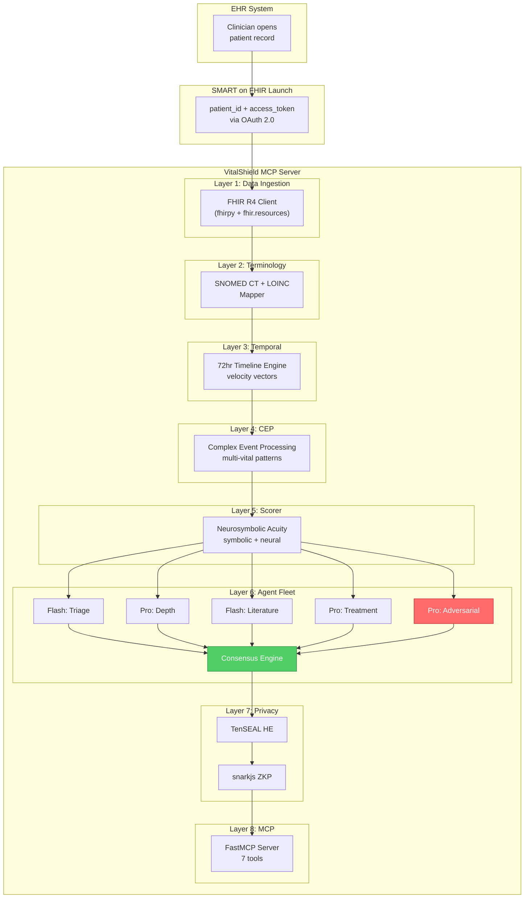

# VitalShield — Bloomberg Terminal for Doctors

> **MCP Server for Real-Time Patient Intelligence, Neurosymbolic Acuity Scoring, and Adversarial Clinical Reasoning**

---

## 1. Vision & Problem Statement

Clinicians today navigate fragmented EHR screens, siloed lab results, and delayed alerting systems. VitalShield is an MCP (Model Context Protocol) server that acts as a **Bloomberg Terminal for doctors** — a single, intelligent surface that continuously ingests patient vitals, normalizes clinical terminology, detects dangerous multi-vital temporal patterns, runs neurosymbolic acuity scoring, and orchestrates a fleet of specialized Gemini agents for deep clinical reasoning — all while keeping patient data encrypted end-to-end.

### What Makes This Different
- **Temporal intelligence**: Not just snapshots — 72-hour velocity vectors show *where the patient is heading*, not just where they are
- **Adversarial validation**: A dedicated agent tries to *disprove* the diagnosis before it reaches the clinician
- **Homomorphic computation**: Agents reason over encrypted data — they never see raw PHI
- **Zero-knowledge audit**: Cryptographic proof of authorized access without creating audit logs that themselves become privacy liabilities

---

## 2. End-to-End Data Flow

```
Clinician opens patient record in EHR
        │
        ▼
SMART on FHIR launch passes patient_id + 
FHIR access_token to VitalShield (automatic)
        │
        ▼
┌──────────────────────────────────────┐
│  LAYER 1 — DATA INGESTION            │
│                                      │
│  fhirpy + fhir.resources fetches     │
│  raw FHIR R4 Bundle:                 │
│    • Observation (vitals, labs)       │
│    • Condition (diagnoses)           │
│    • MedicationRequest               │
│    • Encounter history               │
│    • Patient demographics            │
└──────────────┬───────────────────────┘
               │
               ▼
┌──────────────────────────────────────┐
│  LAYER 2 — TERMINOLOGY NORMALIZATION │
│                                      │
│  SNOMED CT + LOINC mapper resolves   │
│  all codes to canonical form:        │
│    • Local codes → LOINC             │
│    • Free-text dx → SNOMED CT        │
│    • Unit normalization (mg/dL, etc.) │
└──────────────┬───────────────────────┘
               │
               ▼
┌──────────────────────────────────────┐
│  LAYER 3 — TEMPORAL ENGINE           │
│                                      │
│  Builds 72-hour patient timeline:    │
│    • Time-series for every vital     │
│    • Rate of change (Δ/Δt)           │
│    • Velocity vectors (acceleration) │
│    • Gap-aware interpolation         │
│    • Confidence intervals per point  │
└──────────────┬───────────────────────┘
               │
               ▼
┌──────────────────────────────────────┐
│  LAYER 4 — COMPLEX EVENT PROCESSING  │
│                                      │
│  CEP engine scans timeline for       │
│  dangerous multi-vital patterns:     │
│                                      │
│  EXAMPLE PATTERN (early sepsis):     │
│  HR ↑ >20% AND MAP < 65 AND         │
│  temp spike AND lactate rising       │
│  WITHIN same 6-hour window           │
│  = SEPSIS SIGNATURE FIRES            │
└──────────────┬───────────────────────┘
               │
               ▼
┌──────────────────────────────────────┐
│  LAYER 5 — NEUROSYMBOLIC SCORER      │
│                                      │
│  Hybrid scoring pipeline:            │
│    1. Symbolic: hard clinical rules  │
│       (qSOFA, SIRS, NEWS2)           │
│    2. Neural: autoencoder anomaly    │
│       detection on vital patterns    │
│    3. Output: 0–100 acuity score     │
│       + full reasoning trace         │
└──────────────┬───────────────────────┘
               │
               ▼
┌──────────────────────────────────────┐
│  LAYER 6 — GEMINI AGENT FLEET        │
│  (5 agents in parallel)              │
│                                      │
│  Agent 1 — Flash (Triage)            │
│  Agent 2 — Pro (Depth)               │
│  Agent 3 — Flash (Literature)        │
│  Agent 4 — Pro (Treatment)           │
│  Agent 5 — Pro (Adversarial) ← KEY   │
│                                      │
│  Consensus engine weighs outputs     │
│  → confidence score from agreement   │
└──────────────┬───────────────────────┘
               │
               ▼
┌──────────────────────────────────────┐
│  LAYER 7 — PRIVACY & CRYPTO          │
│                                      │
│  TenSEAL: homomorphic encryption     │
│  → agents compute on ciphertext      │
│                                      │
│  snarkjs: ZK proof of access         │
│  → cryptographic audit trail         │
└──────────────┬───────────────────────┘
               │
               ▼
┌──────────────────────────────────────┐
│  LAYER 8 — MCP TOOL SURFACE          │
│                                      │
│  FastMCP exposes 7 tools to any      │
│  LLM client (Claude, Gemini, etc.)   │
└──────────────────────────────────────┘
```

---

## 3. Architecture Diagram



---

## 4. Directory Structure

```
MCP_health/
├── Plan.md                              ← this file
├── README.md
├── pyproject.toml                       ← project config (uv / poetry)
├── .env.example                         ← API keys, FHIR endpoints
├── docker-compose.yml                   ← local dev stack
│
├── src/
│   └── vitalshield/
│       ├── __init__.py
│       ├── server.py                    ← FastMCP entrypoint + tool registration
│       ├── config.py                    ← settings (pydantic-settings)
│       │
│       ├── fhir/                        ← LAYER 1 — Data Ingestion
│       │   ├── __init__.py
│       │   ├── client.py               ← async FHIR R4 client (fhirpy)
│       │   ├── smart_launch.py         ← SMART on FHIR context propagation
│       │   ├── bundle_parser.py        ← FHIR Bundle → internal models
│       │   └── models.py              ← Pydantic models for patient data
│       │
│       ├── terminology/                 ← LAYER 2 — Terminology Normalization
│       │   ├── __init__.py
│       │   ├── mapper.py              ← unified SNOMED CT + LOINC mapper
│       │   ├── snomed.py              ← SNOMED CT lookup + hierarchy
│       │   ├── loinc.py               ← LOINC code resolution
│       │   └── lookups/               ← local lookup tables (JSON/SQLite)
│       │       ├── loinc_common.json
│       │       └── snomed_common.json
│       │
│       ├── temporal/                    ← LAYER 3 — Temporal Engine
│       │   ├── __init__.py
│       │   ├── timeline.py            ← 72hr timeline builder
│       │   ├── velocity.py            ← rate of change + velocity vectors
│       │   ├── interpolation.py       ← gap-aware interpolation
│       │   └── models.py             ← TimeSeriesPoint, VelocityVector, etc.
│       │
│       ├── cep/                         ← LAYER 4 — Complex Event Processing
│       │   ├── __init__.py
│       │   ├── engine.py              ← CEP engine core
│       │   ├── patterns/              ← pattern definitions
│       │   │   ├── __init__.py
│       │   │   ├── sepsis.py          ← early sepsis signature
│       │   │   ├── cardiac.py         ← cardiac decompensation
│       │   │   ├── respiratory.py     ← respiratory failure
│       │   │   └── hemorrhage.py      ← hemorrhagic shock
│       │   ├── window.py              ← sliding window manager
│       │   └── models.py             ← PatternMatch, CEPAlert, etc.
│       │
│       ├── scoring/                     ← LAYER 5 — Neurosymbolic Scorer
│       │   ├── __init__.py
│       │   ├── scorer.py              ← hybrid scorer orchestrator
│       │   ├── symbolic/
│       │   │   ├── __init__.py
│       │   │   ├── qsofa.py           ← qSOFA scoring (3 criteria)
│       │   │   ├── sirs.py            ← SIRS scoring (4 criteria)
│       │   │   ├── news2.py           ← NEWS2 scoring (7 parameters)
│       │   │   └── rules_engine.py    ← composable clinical rules
│       │   ├── neural/
│       │   │   ├── __init__.py
│       │   │   ├── anomaly.py         ← autoencoder anomaly detector
│       │   │   ├── model.py           ← PyTorch model definition
│       │   │   └── weights/           ← pretrained model weights
│       │   └── models.py             ← AcuityScore, ReasoningTrace
│       │
│       ├── agents/                      ← LAYER 6 — Gemini Agent Fleet
│       │   ├── __init__.py
│       │   ├── fleet.py               ← parallel agent orchestrator
│       │   ├── consensus.py           ← consensus engine + confidence
│       │   ├── prompts/               ← system prompts per agent
│       │   │   ├── triage.py          ← Agent 1 (Flash) prompt
│       │   │   ├── depth.py           ← Agent 2 (Pro) prompt
│       │   │   ├── literature.py      ← Agent 3 (Flash) prompt
│       │   │   ├── treatment.py       ← Agent 4 (Pro) prompt
│       │   │   └── adversarial.py     ← Agent 5 (Pro) prompt
│       │   └── models.py             ← AgentOutput, ConsensusResult
│       │
│       ├── privacy/                     ← LAYER 7 — Privacy & Crypto
│       │   ├── __init__.py
│       │   ├── encryption.py          ← TenSEAL homomorphic encryption
│       │   ├── zkproof.py             ← snarkjs ZK proof generation
│       │   ├── circuits/              ← Circom circuit definitions
│       │   │   └── access_auth.circom
│       │   └── keys/                  ← generated keys (gitignored)
│       │
│       └── tools/                       ← LAYER 8 — MCP Tool Surface
│           ├── __init__.py
│           ├── patient_intel.py       ← get_patient_intelligence
│           ├── acuity.py              ← get_acuity_score
│           ├── temporal_profile.py    ← get_temporal_profile
│           ├── subscribe.py           ← subscribe_vitals
│           ├── sepsis.py              ← get_sepsis_risk
│           ├── explain.py             ← explain_score
│           └── verify.py              ← verify_access
│
├── tests/
│   ├── conftest.py                     ← shared fixtures (Synthea patients)
│   ├── test_fhir/
│   ├── test_terminology/
│   ├── test_temporal/
│   ├── test_cep/
│   ├── test_scoring/
│   ├── test_agents/
│   ├── test_privacy/
│   └── test_tools/
│
├── data/
│   ├── synthea/                        ← synthetic FHIR bundles (Synthea)
│   │   ├── README.md
│   │   └── generate.sh               ← script to generate patients
│   ├── terminology/                    ← SNOMED CT / LOINC data files
│   └── models/                         ← pretrained neural weights
│
├── circuits/                            ← Circom ZK circuits (compiled)
│   ├── access_auth.circom
│   └── build.sh                        ← compilation script
│
├── scripts/
│   ├── generate_synthea.sh            ← generate synthetic patients
│   ├── setup_terminology.py           ← download SNOMED/LOINC lookups
│   ├── train_anomaly_model.py         ← train autoencoder on Synthea data
│   └── demo.py                        ← full demo walkthrough
│
└── docs/
    ├── ARCHITECTURE.md
    ├── CLINICAL_RULES.md              ← qSOFA, SIRS, NEWS2 implementations
    ├── PRIVACY.md                     ← HE + ZKP design decisions
    └── MCP_TOOLS.md                   ← tool API documentation
```

---

## 5. Layer-by-Layer Implementation Detail

---

### 5.1 — LAYER 1: FHIR R4 Data Ingestion

#### What It Does
Receives a `patient_id` and FHIR `access_token` from the SMART on FHIR launch context, then fetches the complete clinical picture from the FHIR R4 server.

#### SMART on FHIR Context Propagation
When a clinician opens a patient record in the EHR, the EHR performs a SMART launch:

1. EHR opens VitalShield's launch URL with an opaque `launch` parameter
2. VitalShield exchanges this for an OAuth 2.0 authorization code
3. Token response includes `access_token` + `patient` ID:
   ```json
   {
     "access_token": "eyJ...",
     "token_type": "Bearer",
     "patient": "Patient/12345",
     "encounter": "Encounter/67890"
   }
   ```
4. VitalShield uses this token to fetch FHIR resources

#### FHIR Resources Fetched

| FHIR Resource | Purpose | Key Fields |
|---|---|---|
| `Patient` | Demographics | name, birthDate, gender |
| `Observation` | Vitals + labs | code (LOINC), value, effectiveDateTime |
| `Condition` | Active diagnoses | code (SNOMED CT), clinicalStatus |
| `MedicationRequest` | Current medications | medicationCodeableConcept, dosage |
| `Encounter` | Visit context | class, period, type |
| `Procedure` | Recent procedures | code, performedDateTime |
| `AllergyIntolerance` | Allergies | code, criticality |

#### Internal Pydantic Models

```python
class PatientProfile(BaseModel):
    patient_id: str
    demographics: Demographics
    vitals: list[VitalReading]
    labs: list[LabResult]
    conditions: list[Condition]
    medications: list[Medication]
    encounters: list[Encounter]
    fetched_at: datetime
    fhir_server: str

class VitalReading(BaseModel):
    code: str              # LOINC code
    display: str           # human-readable name
    value: float
    unit: str
    timestamp: datetime
    source_code: str       # original code before normalization
    confidence: float      # 0-1 data quality score
```

#### Open Source Libraries

| Library | Purpose | Install |
|---|---|---|
| **`fhirpy`** | Async FHIR R4 client (CRUD + search) | `pip install fhirpy` |
| **`fhir.resources`** | Pydantic v2 FHIR data models with validation | `pip install fhir.resources` |
| **`httpx`** | Async HTTP client for FHIR requests | `pip install httpx` |

> **Tip**: Use `fhirpy` for the client + `fhir.resources` for data models — this gives you both async support and Pydantic validation. Avoid the legacy `fhirclient` which lacks async and modern type hints.

---

### 5.2 — LAYER 2: SNOMED CT + LOINC Terminology Normalization

#### What It Does
EHR systems send clinical codes in wildly inconsistent formats — local codes, ICD-10 snippets, free-text descriptions. This layer normalizes everything to canonical SNOMED CT (diagnoses/conditions) and LOINC (observations/labs) codes.

#### Normalization Pipeline

```
Raw FHIR code arrives
        │
        ▼
Is it already canonical LOINC/SNOMED? ──yes──► pass through
        │ no
        ▼
Check local lookup table (fast) ──found──► map + return
        │ not found
        ▼
Query terminology server API ──found──► map + cache
        │ not found
        ▼
Fuzzy match against known codes ──► best match + flag low confidence
```

#### Key Normalization Examples

| Input (messy) | Output (canonical) |
|---|---|
| `"HR"`, `"heart rate"`, local code `"VS-001"` | LOINC `8867-4` — Heart rate |
| `"BP systolic"`, `"SBP"`, `"sys bp"` | LOINC `8480-6` — Systolic blood pressure |
| `"temp"`, `"T"`, `"body temperature"` | LOINC `8310-5` — Body temperature |
| `"sepsis"`, `"A41.9"` (ICD-10) | SNOMED CT `91302008` — Sepsis |
| `"lactate"`, `"lactic acid"` | LOINC `2524-7` — Lactate [Moles/volume] in Serum/Plasma |

#### Unit Normalization
All physical quantities are converted to standard units:

| Vital | Standard Unit |
|---|---|
| Temperature | °C (Celsius) |
| Blood Pressure | mmHg |
| Heart Rate | bpm |
| SpO₂ | % |
| Lactate | mmol/L |
| Respiratory Rate | breaths/min |

#### Open Source Libraries

| Library | Purpose | Install |
|---|---|---|
| **`snomedizer`** | Python wrapper for SNOMED CT Snowstorm API | `pip install snomedizer` |
| **`biolookup`** | Biomedical term normalization and lookup | `pip install biolookup` |
| **`rapidfuzz`** | Fast fuzzy string matching for fallback | `pip install rapidfuzz` |
| **Local SQLite DB** | Prebuilt lookup tables for the ~200 most common LOINC/SNOMED codes used in ICU/ED settings | ship with project |

> **Note**: For demo/prototype, ship a local SQLite or JSON lookup table with the ~200 most common vital/lab LOINC codes and ~500 common SNOMED CT diagnosis codes. This covers 95%+ of ICU/ED use cases without needing a live terminology server.

#### External APIs (optional, for production)
- **SNOMED CT**: [Snowstorm FHIR Terminology Server](https://browser.ihtsdotools.org/) (free, open source)
- **LOINC**: [LOINC FHIR server](https://fhir.loinc.org/) (free with registration)
- **UMLS API**: For cross-vocabulary mapping (NLM, free with license)

---

### 5.3 — LAYER 3: 72-Hour Temporal Engine

#### What It Does
Transforms point-in-time observations into a **continuous temporal profile** — not just "what are the vitals now?" but "where are they heading, and how fast?"

#### Core Concepts

##### 1. Timeline Construction
- Pull all `Observation` resources for the patient within the last 72 hours
- Sort by `effectiveDateTime`
- Group by vital type (using normalized LOINC codes)
- Handle irregular sampling intervals (vitals may arrive every 5 min in ICU, every 4 hours on med-surg)

##### 2. Rate of Change (Δ/Δt)
For each vital at each timepoint:
```
rate_of_change = (value_current - value_previous) / (time_current - time_previous)
```

##### 3. Velocity Vectors
Second derivative — is the rate of change itself accelerating?
```
acceleration = (rate_current - rate_previous) / (time_current - time_previous)
```

A positive acceleration on heart rate + negative acceleration on blood pressure = compound deterioration pattern.

##### 4. Gap-Aware Interpolation
Real clinical data has gaps (patient in surgery, sensor disconnected). The engine:
- Marks gaps > 2× expected sampling interval
- Uses linear interpolation for short gaps (< 30 min)
- Uses missing-data-aware interpolation for longer gaps
- Flags interpolated values with reduced confidence scores

#### Data Model

```python
class TemporalProfile(BaseModel):
    patient_id: str
    window_start: datetime       # 72 hours ago
    window_end: datetime         # now
    vitals: dict[str, VitalTimeSeries]   # keyed by LOINC code
    
class VitalTimeSeries(BaseModel):
    loinc_code: str
    display_name: str
    unit: str
    points: list[TimeSeriesPoint]
    current_rate: float          # latest Δ/Δt
    current_acceleration: float  # latest Δ²/Δt²
    trend: Literal["rising", "falling", "stable", "volatile"]
    
class TimeSeriesPoint(BaseModel):
    timestamp: datetime
    value: float
    rate_of_change: float | None
    acceleration: float | None
    is_interpolated: bool
    confidence: float            # 0-1
```

#### Open Source Libraries

| Library | Purpose | Install |
|---|---|---|
| **`numpy`** | Numerical computation, derivatives | `pip install numpy` |
| **`scipy`** | Interpolation (`scipy.interpolate`) | `pip install scipy` |
| **`pandas`** | Time-series data manipulation | `pip install pandas` |
| **`tsdownsample`** | Efficient downsampling for visualization | `pip install tsdownsample` |

---

### 5.4 — LAYER 4: Complex Event Processing (CEP)

#### What It Does
Continuously scans the temporal profile for **dangerous multi-vital patterns** — correlations across multiple vitals within time windows that indicate emerging clinical crises.

#### Pattern Definition Language

Each pattern is defined as a Python class with:
- **Conditions**: Boolean predicates on vital values, rates, and velocities
- **Temporal window**: How long all conditions must co-occur
- **Severity**: How dangerous the pattern is
- **Evidence chain**: Which vitals contributed to the match

#### Core Patterns

##### Pattern 1: Early Sepsis Signature
```python
class EarlySepsisPattern(CEPPattern):
    name = "early_sepsis"
    window = timedelta(hours=6)
    severity = "critical"
    
    conditions = [
        VitalCondition("8867-4",  op="rise_pct", threshold=20),   # HR rises >20%
        VitalCondition("76536-0", op="lt", threshold=65),          # MAP < 65 mmHg
        VitalCondition("8310-5",  op="spike", threshold=38.3),     # temp spike >38.3°C
        VitalCondition("2524-7",  op="rising", rate_threshold=0),  # lactate rising
    ]
    min_conditions = 3  # fire if at least 3 of 4 conditions met
```

##### Pattern 2: Cardiac Decompensation
```python
class CardiacDecompPattern(CEPPattern):
    name = "cardiac_decompensation"
    window = timedelta(hours=4)
    severity = "critical"
    
    conditions = [
        VitalCondition("8867-4",  op="gt", threshold=120),        # HR > 120
        VitalCondition("8480-6",  op="falling", rate_threshold=-5), # SBP falling
        VitalCondition("2710-2",  op="lt", threshold=93),          # SpO2 < 93%
        VitalCondition("9279-1",  op="gt", threshold=24),          # RR > 24
    ]
```

##### Pattern 3: Hemorrhagic Shock
```python
class HemorrhagicShockPattern(CEPPattern):
    name = "hemorrhagic_shock"
    window = timedelta(hours=2)
    severity = "emergency"
    
    conditions = [
        VitalCondition("8867-4",  op="rise_pct", threshold=30),   # HR rises >30%
        VitalCondition("8480-6",  op="lt", threshold=90),          # SBP < 90
        VitalCondition("76536-0", op="falling", rate_threshold=-3), # MAP falling
        VitalCondition("718-7",   op="falling", rate_threshold=0), # Hemoglobin falling
    ]
```

##### Pattern 4: Respiratory Failure
```python
class RespFailurePattern(CEPPattern):
    name = "respiratory_failure"
    window = timedelta(hours=3)
    severity = "critical"
    
    conditions = [
        VitalCondition("2710-2",  op="lt", threshold=90),          # SpO2 < 90%
        VitalCondition("9279-1",  op="gt", threshold=28),          # RR > 28
        VitalCondition("2019-8",  op="gt", threshold=45),          # PaCO2 > 45 mmHg
        VitalCondition("2703-7",  op="lt", threshold=60),          # PaO2 < 60 mmHg
    ]
```

#### CEP Engine Design

Two options depending on scale:

| Approach | When to Use | Library |
|---|---|---|
| **Custom Python CEP** | Demo / single hospital / < 1000 patients | Built-in (this project) |
| **Apache Flink (PyFlink)** | Production / multi-hospital / > 10K patients | `apache-flink` |

For the MCP server (single-patient, on-demand), the **custom Python CEP** is the right choice. It uses sliding windows over the temporal profile and evaluates patterns without needing a distributed streaming framework.

#### Open Source Libraries

| Library | Purpose | Install |
|---|---|---|
| **Custom implementation** | Sliding-window pattern matching (primary) | built-in |
| **`PyFlink`** | Production-scale streaming CEP (upgrade path) | `pip install apache-flink` |
| **`PySiddhi`** | SQL-like CEP expressions (alternative) | `pip install PySiddhi` |
| **`OpenCEP`** | Lightweight Python-native CEP | `pip install OpenCEP` |

> **Important**: For the MCP server use case, build a custom CEP engine. It's simpler, has no JVM dependency, and handles the on-demand per-patient use case better than distributed streaming engines. Reserve PyFlink for a future real-time streaming mode where vitals are continuously ingested.

---

### 5.5 — LAYER 5: Neurosymbolic Acuity Scorer

#### What It Does
Produces a **0–100 acuity score** with a full reasoning trace by combining two approaches:

1. **Symbolic**: Hard clinical rules that no amount of data should override
2. **Neural**: Anomaly detection that catches subtle patterns rules might miss

#### Symbolic Scoring — Clinical Rules

##### qSOFA (quick Sequential Organ Failure Assessment)
| Criterion | Threshold | Score |
|---|---|---|
| Respiratory rate | ≥ 22 breaths/min | +1 |
| Altered mental status | GCS < 15 | +1 |
| Systolic blood pressure | ≤ 100 mmHg | +1 |
| **Positive** | **≥ 2** | |

##### SIRS (Systemic Inflammatory Response Syndrome)
| Criterion | Threshold | Score |
|---|---|---|
| Temperature | > 38°C or < 36°C | +1 |
| Heart rate | > 90 bpm | +1 |
| Respiratory rate | > 20 breaths/min OR PaCO₂ < 32 mmHg | +1 |
| WBC count | > 12,000/μL or < 4,000/μL or > 10% bands | +1 |
| **Positive** | **≥ 2** | |

##### NEWS2 (National Early Warning Score 2)
| Parameter | Score 3 | Score 2 | Score 1 | Score 0 | Score 1 | Score 2 | Score 3 |
|---|---|---|---|---|---|---|---|
| RR | ≤8 | | 9–11 | 12–20 | | 21–24 | ≥25 |
| SpO₂ Scale 1 | ≤91 | 92–93 | 94–95 | ≥96 | | | |
| Air/O₂ | | O₂ | | Air | | | |
| SBP | ≤90 | 91–100 | 101–110 | 111–219 | | | ≥220 |
| Pulse | ≤40 | | 41–50 | 51–90 | 91–110 | 111–130 | ≥131 |
| Consciousness | | | | Alert | | | CVPU |
| Temperature | ≤35.0 | | 35.1–36.0 | 36.1–38.0 | 38.1–39.0 | ≥39.1 | |

##### Composable Acuity Formula
```python
symbolic_score = (
    qsofa_score * 15 +           # max 45 (3 criteria × 15)
    sirs_contribution * 8 +       # max 32 (4 criteria × 8)
    news2_score_normalized * 23   # max 23 (NEWS2 ≥ 7 maps to 23)
)
# symbolic_score range: 0–100
# But capped at 70 to leave room for neural boost
symbolic_score = min(symbolic_score, 70)
```

#### Neural Scoring — Anomaly Detection

A **Variational Autoencoder (VAE)** trained on "normal" vital sign trajectories from Synthea data. At inference:

1. Encode the patient's 72-hour vital trajectory
2. Reconstruct it through the decoder
3. Measure reconstruction error
4. High reconstruction error = anomalous trajectory = higher neural score

```python
neural_score = min(30, reconstruction_error * scaling_factor)
# neural_score range: 0–30
```

#### Combined Score
```python
acuity_score = symbolic_score + neural_score  # 0–100

# Reasoning trace includes:
# - Which qSOFA/SIRS/NEWS2 criteria fired
# - Which vitals the neural model flagged as anomalous
# - Confidence level for each component
```

#### Open Source Libraries

| Library | Purpose | Install |
|---|---|---|
| **`torch` (PyTorch)** | VAE model for anomaly detection | `pip install torch` |
| **`scikit-learn`** | Alternative: Isolation Forest, LOF | `pip install scikit-learn` |
| **`pyod`** | 30+ anomaly detection algorithms | `pip install pyod` |
| **`tslearn`** | Time-series specific ML | `pip install tslearn` |

> **Tip**: Start with a simple **Isolation Forest** from scikit-learn for the prototype. It requires zero training data tuning and works surprisingly well on multivariate vital sign data. Upgrade to PyTorch VAE when you have enough Synthea training data.

---

### 5.6 — LAYER 6: Gemini Agent Fleet

#### What It Does
Five specialized Gemini agents execute **in parallel** using `asyncio.gather`, each analyzing the patient from a different clinical lens. A consensus engine then weighs their outputs.

#### Agent Specifications

| # | Name | Model | Role | System Prompt Focus |
|---|---|---|---|---|
| 1 | **Triage** | Gemini Flash | Rapid initial clinical assessment | "You are an ED triage nurse. Given these vitals, labs, and trends, provide an immediate severity assessment. Be fast, be clear." |
| 2 | **Depth** | Gemini Pro | Deep reasoning against clinical criteria | "You are an attending intensivist. Apply qSOFA, SIRS, NEWS2 criteria. Reason step by step. Identify the most likely clinical trajectory." |
| 3 | **Literature** | Gemini Flash | Evidence validation | "You are a clinical evidence specialist. Validate whether the observed pattern matches published clinical evidence for the suspected condition." |
| 4 | **Treatment** | Gemini Pro | Intervention suggestions | "You are a critical care pharmacist + physician. Suggest immediate interventions with dosages, monitoring parameters, and contraindication checks." |
| 5 | **Adversarial** | Gemini Pro | **Actively tries to disprove the diagnosis** | "You are a diagnostic devil's advocate. Your job is to find ALTERNATIVE explanations. 'Could this be X instead of sepsis?' Challenge every assumption." |

#### Parallel Execution

```python
async def run_fleet(patient_context: PatientContext) -> list[AgentOutput]:
    agents = [
        triage_agent(patient_context),      # Flash — fast
        depth_agent(patient_context),        # Pro — thorough 
        literature_agent(patient_context),   # Flash — fast
        treatment_agent(patient_context),    # Pro — thorough
        adversarial_agent(patient_context),  # Pro — contrarian
    ]
    results = await asyncio.gather(*agents, return_exceptions=True)
    return results
```

#### Consensus Engine

```python
class ConsensusResult(BaseModel):
    primary_diagnosis: str
    confidence: float                    # 0-1 based on agreement
    agent_agreement: dict[str, float]    # per-agent agreement weight
    dissent: list[str]                   # adversarial agent's alternatives
    treatment_suggestions: list[Treatment]
    reasoning_trace: str                 # full chain of thought
```

**Confidence Calculation**:
- All 5 agents agree → confidence = 0.95
- 4 of 5 agree (adversarial dissents with weak alternatives) → 0.85
- 4 of 5 agree (adversarial dissents with strong alternatives) → 0.65
- 3 of 5 agree → 0.50
- No majority → 0.30 (flag for human review)

#### Open Source Libraries

| Library | Purpose | Install |
|---|---|---|
| **`google-generativeai`** | Gemini API client (Flash + Pro) | `pip install google-generativeai` |
| **`google-adk`** | Agent Development Kit for orchestration | `pip install google-adk` |
| **`asyncio`** | Parallel agent execution | stdlib |
| **`pydantic`** | Structured agent output parsing | `pip install pydantic` |

---

### 5.7 — LAYER 7: Privacy & Cryptography

#### 5.7.1 — Homomorphic Encryption (TenSEAL)

##### What It Does
Wraps patient vitals in CKKS homomorphic encryption so that the Gemini agents and scoring pipeline can compute on ciphertext — they never see raw patient values.

##### How It Works in VitalShield

```
Raw vitals (e.g., HR=120, BP=85/55, Temp=39.2)
        │
        ▼
TenSEAL encrypts each vital value into a CKKSVector
        │
        ▼
Scoring computations happen on encrypted vectors:
  - Addition: enc(HR) + enc(threshold) → enc(result)
  - Comparison: approximate via polynomial evaluation
  - Neural inference: evaluate on encrypted tensors
        │
        ▼
Results decrypted only at the final output step
by the authorized clinician's key
```

##### Practical Considerations

> **Warning**: Full homomorphic encryption on the agent fleet is computationally expensive and adds ~10-50x latency. For the prototype, apply HE selectively:
> - **Always encrypt**: Patient identifiers, demographics, raw lab values in storage/transit
> - **Encrypt when feasible**: Vital sign vectors during scoring
> - **Skip HE for**: Free-text agent prompts (use standard TLS + access controls instead)
> 
> The demo should show the HE capability working on the scoring pipeline, with a clear upgrade path to full HE in production.

##### Key Code Pattern
```python
import tenseal as ts

# Generate encryption context
context = ts.context(
    ts.SCHEME_TYPE.CKKS,
    poly_modulus_degree=8192,
    coeff_mod_bit_sizes=[60, 40, 40, 60]
)
context.global_scale = 2**40
context.generate_galois_keys()

# Encrypt vitals
vitals_plain = [120.0, 85.0, 55.0, 39.2, 98.0]  # HR, SBP, DBP, Temp, SpO2
vitals_enc = ts.ckks_vector(context, vitals_plain)

# Compute on encrypted data
thresholds = ts.ckks_vector(context, [100.0, 90.0, 60.0, 38.0, 95.0])
deviations = vitals_enc - thresholds  # computed on ciphertext!

# Decrypt only at the end
result = deviations.decrypt()
```

#### 5.7.2 — Zero-Knowledge Proofs (snarkjs)

##### What It Does
Generates a cryptographic proof that a clinician is authorized to access a patient's data — without revealing *which* clinician or *which* patient to the audit system.

##### ZK Circuit Design

```
Inputs (private — known only to prover):
  - clinician_id
  - patient_id  
  - access_timestamp
  - authorization_token

Inputs (public — known to verifier):
  - merkle_root of authorized access list
  - commitment hash

Circuit proves:
  "I know a (clinician, patient, token) triple that 
   exists in the authorized access Merkle tree,
   without revealing which triple"
```

##### Integration via Python

Since `snarkjs` is JavaScript/WASM-based, use one of:

| Approach | Library | Notes |
|---|---|---|
| **`zkpy`** | `pip install zkpy` | Python wrapper around `circom` + `snarkjs` CLI |
| **`pysnark`** | `pip install pysnark` | Write ZK programs directly in Python |
| **subprocess** | stdlib | Call `snarkjs` CLI from Python |

> **Note**: `zkpy` is the cleanest option — it handles the `circom` compile → trusted setup → prove → verify lifecycle from Python. Requires `circom` and `snarkjs` installed via `npm`.

##### Installation Requirements
```bash
# Install circom compiler (Rust-based)
cargo install circom

# Install snarkjs
npm install -g snarkjs

# Install Python wrapper
pip install zkpy
```

---

### 5.8 — LAYER 8: MCP Tool Surface (FastMCP)

#### What It Does
Exposes VitalShield's capabilities as **7 MCP tools** that any LLM client (Claude Desktop, Gemini, custom apps) can call.

#### Tool Definitions

```python
from fastmcp import FastMCP

mcp = FastMCP("VitalShield", 
              description="Bloomberg Terminal for Doctors — patient intelligence MCP server")

@mcp.tool()
async def get_patient_intelligence(patient_id: str) -> PatientIntelligence:
    """
    Full patient intelligence profile.
    Returns: complete clinical profile, acuity score, 72hr trajectory,
    agent fleet consensus, and treatment suggestions.
    """
    ...

@mcp.tool()
async def get_acuity_score(patient_id: str) -> AcuityResult:
    """
    Neurosymbolic acuity score (0-100).
    Returns: score + full reasoning trace showing which symbolic rules
    and neural anomalies contributed.
    """
    ...

@mcp.tool()
async def get_temporal_profile(patient_id: str) -> TemporalProfile:
    """
    72-hour temporal profile with velocity vectors.
    Returns: time series for every vital with rate of change,
    acceleration, and trend classification.
    """
    ...

@mcp.tool()
async def subscribe_vitals(patient_id: str, webhook_url: str) -> SubscriptionResult:
    """
    Subscribe to real-time score updates.
    Fires webhook when vitals stream in and CEP detects new patterns.
    Returns: subscription_id for management.
    """
    ...

@mcp.tool()
async def get_sepsis_risk(patient_id: str) -> SepsisAnalysis:
    """
    Dedicated sepsis CEP analysis with full agent fleet reasoning.
    Returns: sepsis probability, qSOFA/SIRS/NEWS2 scores,
    temporal pattern matches, and adversarial differential diagnosis.
    """
    ...

@mcp.tool()
async def explain_score(patient_id: str) -> ClinicalExplanation:
    """
    Natural language clinical reasoning explanation.
    Includes adversarial agent dissent and alternative diagnoses.
    Returns: human-readable explanation suitable for clinical documentation.
    """
    ...

@mcp.tool()
async def verify_access(zk_proof: str) -> AccessVerification:
    """
    Cryptographic access verification via zero-knowledge proof.
    Verifies that the caller has authorized access without revealing identity.
    Returns: verified (bool) + proof metadata.
    """
    ...
```

#### Open Source Libraries

| Library | Purpose | Install |
|---|---|---|
| **`fastmcp`** | MCP server framework | `pip install fastmcp` |
| **`uvicorn`** | ASGI server for FastMCP | `pip install uvicorn` |
| **`pydantic`** | Tool input/output schemas | `pip install pydantic` |

---

## 6. Synthetic Data Strategy (Synthea)

#### What Is Synthea?
[Synthea](https://github.com/synthetichealth/synthea) is an open-source synthetic patient generator that creates realistic (but fake) patient records in FHIR R4 format. It simulates disease progression, medication history, hospital encounters, and vitals over time.

#### Why Synthea?
- Generates **FHIR R4 bundles** natively — no conversion needed
- Simulates **realistic vital sign trajectories** including deterioration patterns
- Includes **messy data** (inconsistent codes, missing values, unit variations) — perfect for testing the normalization pipeline
- **No PHI concerns** — fully synthetic, no IRB needed

#### Generating Test Data

```bash
# Install Synthea (requires Java 11+)
git clone https://github.com/synthetichealth/synthea.git
cd synthea

# Generate 100 patients from Massachusetts with sepsis module
./run_synthea -p 100 -m sepsis Massachusetts

# Output: FHIR R4 Bundles in output/fhir/
```

#### Custom Modules
Synthea supports custom disease modules. Create a **VitalShield test module** that generates:
- Patients with gradual sepsis onset (6-hour deterioration curves)
- Patients with cardiac decompensation patterns
- Healthy patients (negative controls)
- Patients with ambiguous presentations (tests adversarial agent)

#### Alternative Data Sources

| Source | Type | Notes |
|---|---|---|
| **Synthea** | Synthetic FHIR R4 | Primary — realistic, free, no PHI |
| **MIMIC-IV** | Real ICU data (deidentified) | Requires PhysioNet credential, real clinical patterns |
| **eICU** | Real multi-center ICU data | PhysioNet, more hospitals |
| **HAPI FHIR Server** | Test FHIR server | `docker run -p 8080:8080 hapiproject/hapi` |

---

## 7. Complete Open Source Stack Summary

### Core Framework

| Component | Library | Version | License |
|---|---|---|---|
| MCP Server | `fastmcp` | latest | MIT |
| Python Runtime | Python | 3.11+ | PSF |
| Package Manager | `uv` | latest | MIT |
| Settings | `pydantic-settings` | 2.x | MIT |

### Data & FHIR

| Component | Library | License |
|---|---|---|
| FHIR Client | `fhirpy` | MIT |
| FHIR Models | `fhir.resources` | BSD |
| HTTP Client | `httpx` | BSD |
| Synthetic Data | `synthea` | Apache 2.0 |

### Terminology

| Component | Library | License |
|---|---|---|
| SNOMED CT Client | `snomedizer` | MIT |
| Fuzzy Matching | `rapidfuzz` | MIT |
| Lookup DB | `sqlite3` | stdlib |

### Temporal & CEP

| Component | Library | License |
|---|---|---|
| Numerical | `numpy` | BSD |
| Interpolation | `scipy` | BSD |
| Time Series | `pandas` | BSD |
| CEP (production path) | `apache-flink` (PyFlink) | Apache 2.0 |
| CEP (alternative) | `OpenCEP` | MIT |

### Scoring & ML

| Component | Library | License |
|---|---|---|
| Neural Network | `torch` (PyTorch) | BSD |
| Anomaly Detection | `pyod` | BSD |
| Isolation Forest | `scikit-learn` | BSD |
| Time Series ML | `tslearn` | BSD |

### AI Agents

| Component | Library | License |
|---|---|---|
| Gemini API | `google-generativeai` | Apache 2.0 |
| Agent Framework | `google-adk` | Apache 2.0 |
| Async | `asyncio` | stdlib |

### Privacy & Crypto

| Component | Library | License |
|---|---|---|
| Homomorphic Encryption | `tenseal` | MIT |
| ZK Proofs (Python) | `zkpy` | MIT |
| ZK Proofs (alt) | `pysnark` | MIT |
| Circuit Compiler | `circom` (Rust) | GPL 3.0 |
| Proof System | `snarkjs` (npm) | GPL 3.0 |

### Testing & DevOps

| Component | Library | License |
|---|---|---|
| Testing | `pytest` + `pytest-asyncio` | MIT |
| FHIR Test Server | `hapiproject/hapi` (Docker) | Apache 2.0 |
| Linting | `ruff` | MIT |
| Type Checking | `mypy` | MIT |

---

## 8. Phased Build Plan

### Phase 1 — Foundation (Week 1–2)
> Get the data pipeline working end-to-end with synthetic data

- [ ] Project scaffolding (`pyproject.toml`, directory structure)
- [ ] Generate Synthea patients (100 patients, sepsis + cardiac modules)
- [ ] Stand up HAPI FHIR server in Docker, load Synthea bundles
- [ ] Implement FHIR R4 client (`fhirpy` + `fhir.resources`)
- [ ] Implement SMART on FHIR context propagation (simulated)
- [ ] Build Pydantic models for internal patient data
- [ ] Basic FastMCP server with `get_patient_intelligence` stub
- [ ] **Milestone**: Can fetch a Synthea patient and print vitals

### Phase 2 — Terminology + Temporal (Week 3–4)
> Normalize data and build the timeline

- [ ] Build local LOINC/SNOMED lookup tables (JSON/SQLite)
- [ ] Implement terminology mapper with fallback chain
- [ ] Implement 72-hour timeline builder
- [ ] Implement rate-of-change and velocity vector calculation
- [ ] Implement gap-aware interpolation
- [ ] Wire `get_temporal_profile` MCP tool
- [ ] **Milestone**: Can show a patient's 72-hour velocity profile

### Phase 3 — CEP + Scoring (Week 5–6)
> Detect patterns and score patients

- [ ] Implement custom CEP engine with sliding windows
- [ ] Define sepsis, cardiac, respiratory, hemorrhage patterns
- [ ] Implement qSOFA, SIRS, NEWS2 symbolic scorers
- [ ] Implement Isolation Forest anomaly detector (scikit-learn)
- [ ] Build neurosymbolic scorer combining both
- [ ] Wire `get_acuity_score` and `get_sepsis_risk` MCP tools
- [ ] **Milestone**: Can detect sepsis in a Synthea patient and score 0–100

### Phase 4 — Agent Fleet (Week 7–8)
> Stand up the Gemini fleet with adversarial validation

- [ ] Design system prompts for all 5 agents
- [ ] Implement parallel fleet executor (`asyncio.gather`)
- [ ] Implement consensus engine with confidence scoring
- [ ] Build structured output parsing (Pydantic)
- [ ] Wire `explain_score` MCP tool
- [ ] **Milestone**: Full fleet runs on a patient, adversarial agent challenges diagnosis

### Phase 5 — Privacy Layer (Week 9–10)
> Add homomorphic encryption and zero-knowledge proofs

- [ ] Implement TenSEAL encryption wrapper for vital vectors
- [ ] Demonstrate scoring on encrypted data
- [ ] Write Circom circuit for access authorization
- [ ] Implement ZK proof generation and verification via `zkpy`
- [ ] Wire `verify_access` MCP tool
- [ ] **Milestone**: Can prove authorized access without revealing identity

### Phase 6 — Real-Time + Polish (Week 11–12)
> Add streaming subscriptions and production hardening

- [ ] Implement `subscribe_vitals` with webhook delivery
- [ ] Add WebSocket support for real-time score pushes
- [ ] Comprehensive test suite (>80% coverage)
- [ ] Performance optimization (caching, connection pooling)
- [ ] Documentation (ARCHITECTURE.md, MCP_TOOLS.md, CLINICAL_RULES.md)
- [ ] Demo script showing full flow from patient open → alert
- [ ] **Milestone**: Complete demo with all 7 MCP tools working

---

## 9. Running the Server

```bash
# Install dependencies
uv sync

# Set environment variables
cp .env.example .env
# Edit .env with your Gemini API key, FHIR server URL, etc.

# Start HAPI FHIR server (for demo)
docker-compose up -d hapi-fhir

# Load Synthea data
python scripts/generate_synthea.sh
python scripts/load_synthea.py

# Run VitalShield MCP server
uv run python -m vitalshield.server

# Or via FastMCP CLI
fastmcp run src/vitalshield/server.py
```

---

## 10. Key Design Decisions & Trade-offs

| Decision | Choice | Rationale |
|---|---|---|
| Custom CEP vs. PyFlink | Custom first, Flink later | MCP is on-demand per-patient, not a streaming pipeline. Custom is simpler, no JVM. |
| Isolation Forest vs. VAE | Start with IF, upgrade to VAE | IF needs no training, works out-of-box. VAE needs curated training data from Synthea. |
| TenSEAL scope | Selective HE, not full | Full HE adds 10-50x latency. Encrypt critical data paths; use TLS for agent prompts. |
| snarkjs integration | `zkpy` wrapper | Avoids raw subprocess calls; handles full lifecycle. Still needs `circom` + `snarkjs` installed. |
| Agent framework | Raw `google-generativeai` + asyncio | Simpler than full ADK for 5 agents. Upgrade to ADK if agent count grows. |
| FHIR client | `fhirpy` + `fhir.resources` | Modern async + Pydantic. Avoids legacy `fhirclient`. |
| Terminology | Local lookup + fuzzy fallback | Fast, no external deps for demo. Production adds Snowstorm server. |

---

## 11. Risk Register

| Risk | Impact | Mitigation |
|---|---|---|
| Gemini rate limits with 5 parallel agents | Agent fleet fails or is slow | Implement exponential backoff; batch requests; cache repeated analyses |
| TenSEAL CKKS precision loss | Scoring computation gives wrong results | Validate encrypted vs. plaintext outputs; use sufficient polynomial degree |
| Synthea data too "clean" for realism | Pipeline doesn't handle real-world messiness | Intentionally corrupt Synthea data: random code swaps, missing values, unit errors |
| ZK proof generation is slow (~seconds) | Latency in access verification | Pre-compute proofs at session start; cache for session duration |
| Clinical rules have edge cases | False positives/negatives in scoring | Adversarial agent is the safety net; always show reasoning trace for human review |
| FHIR server variability | Different EHRs return different resource structures | Extensive normalization in Layer 2; handle missing fields gracefully |

---

## 12. Future Extensions

- **SMART on FHIR App**: Full web frontend that launches inside Epic/Cerner as an embedded app
- **Voice Mode**: "Hey VitalShield, what's the sepsis risk for bed 12?" via Gemini Live
- **Multi-Patient Dashboard**: ICU-wide view showing all patients ranked by acuity
- **Federated Learning**: Train anomaly detector across hospitals using TenSEAL encrypted gradients
- **FDA SaMD Pathway**: Software as a Medical Device clearance for the scoring pipeline
- **HL7v2 Ingestion**: For hospitals still on legacy HL7v2 feeds (most of them)
- **CDS Hooks**: Publish as a Clinical Decision Support hook in addition to MCP

---

> **Clinical Disclaimer**: VitalShield is a clinical decision *support* tool. It does not replace clinical judgment. All scores, diagnoses, and treatment suggestions must be reviewed by a licensed healthcare professional before any clinical action is taken. This system is not FDA-cleared and should not be used for direct patient care without appropriate regulatory approval.
